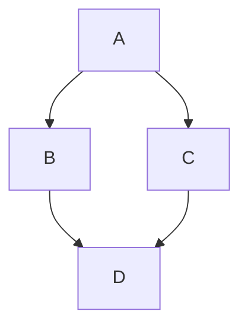

# actions
test actions

# mermaid

```mermaid
graph TD;
    A-->B;
    A-->C;
    B-->D;
    C-->D;
```

<https://docs.github.com/en/get-started/writing-on-github/working-with-advanced-formatting/creating-diagrams>
